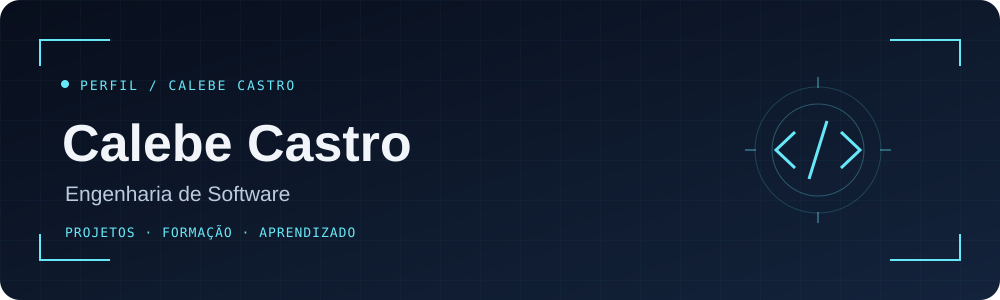

<p align="center">
  
</p>

<p align="center">
  
</p>

<p align="center">
  <a href="#projetos-do-momento">Projetos do momento</a> ·
  <a href="#formação">Formação</a> ·
  <a href="#contato">Contato</a>
</p>

## Sobre mim

Olá! Aqui é Calebe Castro, estudante de Engenharia de Software no Centro Universitário UNISATC.

Tenho interesse em compreender a inteligência artificial e explorar suas aplicações práticas no aprendizado e no desenvolvimento de projetos. Utilizo Claude e ChatGPT para apoiar meus estudos e explorar ideias, buscando entender e avaliar as respostas dessas ferramentas.

Também estudo animação em pixel art, conectando meu interesse por tecnologia à criação visual. Esse cantinho junta minha formação, meus projetos atuais e os aprendizados ao longo desse caminho.

## Projetos do momento

### PetLify · MVP acadêmico

Aplicação web para gestão de pet shops, com cadastro de pets, agendamentos e áreas para clientes, funcionários e donos. O modelo permite atender diferentes lojas com separação dos dados de cada pet shop.

**Tecnologias do projeto:** React, TypeScript, Python, Flask, SQLAlchemy e SQLite.

[Explorar o projeto](https://github.com/calebecastro-5g/PetLify-MVP) · [Documentação](https://github.com/calebecastro-5g/PetLify-MVP/tree/main/PetLify#readme)

### Finanças Fácil · Organização financeira

Aplicação web para reunir receitas, despesas, investimentos e saldos em um único lugar. Inclui acompanhamento mensal e anual, categorias de gastos e separação entre valores previstos e realizados.
Projeto realizado em faculdade, sendo constantemente atualizdo.

**Tecnologias do projeto:** Python, Flask, Jinja2, HTML e CSS; SQLite no desenvolvimento e PostgreSQL em produção.

<!-- Adicionar link público de código ou apresentação quando confirmado. -->

### Site para a minha namorada · Experiência web interativa

Quem aqui nunca amou, que atire a primeira pedra. Este é um projeto que combina animações, interações e um álbum compartilhado com autenticação. Explora criação de interfaces, organização de registros e integração com serviços para armazenamento e busca de informações sobre filmes e séries.
Site pessoal criado para meu aniversário de namoro. 

**Tecnologias do projeto:** HTML, CSS, JavaScript, Supabase e funções do Netlify com integração ao TMDB.

## Formação

**Engenharia de Software**  
Centro Universitário UNISATC · Em andamento  
Conclusão prevista: **2030**

**Formação complementar**  
Estudos em animação pixel art por meio de curso.

<!-- Acrescente nome e instituição do curso de pixel art quando disponíveis. -->

## Ferramentas que utilizo

| Ferramenta | Uso |

| Claude e ChatGPT | Apoio aos estudos, exploração de ideias e aplicações de IA |
| Visual Studio Code | Edição e organização de código |

## Interesses e estudos

- **Inteligência artificial:** compreensão de possibilidades, limitações e principalmente aplicações práticas. 
- **Engenharia de Software:** desenvolvimento da base técnica ao longo da graduação.
- **Animação pixel art:** criação visual e estudo de movimento.

## Aprendizado em andamento

```text
> graduação    Engenharia de Software · UNISATC · previsão 2030
> explorando   entendimento e aplicação de IA
> criatividade animação pixel art
```

## Contato

[Enviar e-mail](mailto:calebkastro@gmail.com)
(https://www.linkedin.com/in/calebe-castro-531008217/?isSelfProfile=true)

<!-- Acrescente LinkedIn ou portfólio apenas após confirmar os links. -->

---

<p align="center"><sub>Calebe Castro · Esforço, dedicação e empenho </sub></p>
